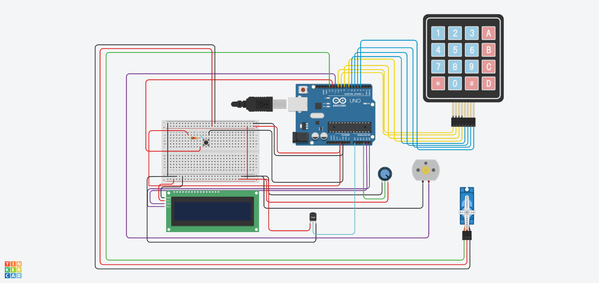

Bu proje **Tinkercad** platformunda tasarlanmış ve simüle edilmiştir. Tinkercad'de devre şemasını görüntülemek ve düzenlemek için projenin Tinkercad linkini kullanabilirsiniz.

**🔗 Tinkercad Proje Linki:** [Arduino Kapı Sistemi](https://www.tinkercad.com/things/jrrzlJgN6BZ-arduinokapisistemi)

# Akıllı Kapı, Turnike ve Fan Kontrol Sistemi

Bu proje, Arduino tabanlı bir akıllı giriş ve ortam kontrol sistemidir. Sistem, şifre ile kapı açma, buton ile turnike kontrolü ve potansiyometre ile ayarlanabilen bir fan sistemi özelliklerini barındırır. Kullanıcı etkileşimleri ve sistem durumu 16x2 I2C LCD ekran üzerinden takip edilebilir.

## 📝 İçindekiler

- [Genel Bakış](#genel-bakış)
- [Özellikler](#özellikler)
- [Kullanılan Donanımlar](#kullanılan-donanımlar)
- [Devre Şeması ve Bağlantılar](#devre-şeması-ve-bağlantılar)
  - [Pin Tanımlamaları](#pin-tanımlamaları)
- [Yazılım ve Kütüphaneler](#yazılım-ve-kütüphaneler)
- [Sistem Mimarisi ve Çalışma Mantığı](#sistem-mimarisi-ve-çalışma-mantığı)
  - [Başlangıç](#başlangıç)
  - [Kapı Açma ve Şifre Girişi](#kapı-açma-ve-şifre-girişi)
  - [Turnike Kontrolü](#turnike-kontrolü)
  - [Fan Kontrolü](#fan-kontrolü)
- [Kod Yapısı](#kod-yapısı)
  - [Global Değişkenler](#global-değişkenler)
  - [`setup()`](#setup)
  - [`loop()`](#loop)
  - [Yardımcı Fonksiyonlar](#yardımcı-fonksiyonlar)
- [Kurulum ve Kullanım](#kurulum-ve-kullanım)
- [Gelecek Geliştirmeler](#gelecek-geliştirmeler)
- [Katkıda Bulunma](#katkıda-bulunma)

## 🌟 Genel Bakış

Proje, bir binaya veya odaya kontrollü erişim sağlamak amacıyla geliştirilmiştir. İlk aşamada bir buton ile kapı açma süreci başlatılır ve kullanıcıdan şifre girmesi istenir. Doğru şifre girildikten sonra, ikinci bir buton basımı ile turnike aktif hale gelir. Son olarak, ortamdaki sıcaklık görüntülenir ve bir potansiyometre ile fan hızı ayarlanabilir. Tüm bu işlemler LCD ekranda kullanıcıya bildirilir.

## ✨ Özellikler

-   **Şifreli Kapı Erişimi:** 4x4 keypad üzerinden girilen şifre ile kapı kontrolü.
-   **LCD Ekran Arayüzü:** Kullanıcıya sistem durumu, talimatlar, sıcaklık ve fan hızı hakkında bilgi veren 16x2 I2C LCD ekran.
-   **Turnike Kontrolü:** Şifre doğrulandıktan sonra buton ile servo motor kontrollü turnike geçişi.
-   **DC Motor Fan Kontrolü:** Potansiyometre ile hızı ayarlanabilen DC motorlu fan.
-   **Sıcaklık Gösterimi:** Analog sıcaklık sensörü ile ortam sıcaklığının okunması ve LCD'de gösterilmesi.
-   **Buton Kontrollü Sistem Akışı:** Sistem durumları arasında geçiş için tek bir butonun çoklu kullanımı.

## 🛠️ Kullanılan Donanımlar

-   Arduino (Uno, Nano vb. uyumlu bir model)
-   16x2 I2C LCD Ekran (Adres: `0x20`)
-   4x4 Matrix Keypad
-   Servo Motor (Turnike için,örn: SG90)
-   DC Motor (Fan için)
-   Potansiyometre (Fan hızı ayarı için, örn: 10KΩ)
-   Push Buton (Ana kontrol butonu)
-   Analog Sıcaklık Sensörü (örn: LM35 veya benzeri, kodda kullanılan formüle uygun)
-   Bağlantı Kabloları
-   Breadboard
-   Gerekli Dirençler (Keypad, buton veya sensör için gerekirse)

## 🔌 Devre Şeması ve Bağlantılar

Bu proje **Tinkercad** platformunda tasarlanmış ve simüle edilmiştir. Tinkercad'de devre şemasını görüntülemek ve düzenlemek için projenin Tinkercad linkini kullanabilirsiniz.

**Tinkercad Proje Linki:** *(Tinkercad'deki proje linkinizi buraya ekleyebilirsiniz)*

*(Ayrıca devre şemasının görsel ekran görüntüsünü de aşağıya ekleyebilirsiniz)*
`<!--  -->`

### Pin Tanımlamaları

Aşağıda projede kullanılan pin bağlantıları listelenmiştir:

-   **LCD Ekran (I2C):**
    -   SDA: Arduino A4 (veya özel SDA pini)
    -   SCL: Arduino A5 (veya özel SCL pini)
    -   I2C Adresi: `0x20`
-   **Keypad:**
    -   Satır Pinleri (R1-R4): `10, 9, 8, 7`
    -   Sütun Pinleri (C1-C4): `6, 5, 4, 3`
-   **DC Motor (Fan):**
    -   PWM Kontrol Pini: `11`
-   **Potansiyometre (Fan Hızı):**
    -   Analog Okuma Pini: `A3`
-   **Ana Kontrol Butonu:**
    -   Dijital Giriş Pini: `12`
-   **Sıcaklık Sensörü:**
    -   Analog Okuma Pini: `A0`
-   **Turnike Servo Motoru:**
    -   PWM Kontrol Pini: `13`

## 💻 Yazılım ve Kütüphaneler

### Tasarım ve Simülasyon:
-   **Tinkercad:** Devre tasarımı ve kod simülasyonu için. (https://www.tinkercad.com)

### Geliştirme Ortamı:
-   **Arduino IDE:** Kodu derlemek ve fiziksel Arduino'ya yüklemek için.

### Gerekli Kütüphaneler:
-   `LiquidCrystal_I2C.h`: I2C LCD ekran kontrolü için.
-   `Keypad.h`: Matrix keypad okumaları için.
-   `Servo.h`: Servo motor kontrolü için.

Bu kütüphaneleri Arduino IDE'deki "Library Manager" (Kütüphane Yöneticisi) üzerinden kurabilirsiniz. (Sketch -> Include Library -> Manage Libraries...)

**Not:** Proje Tinkercad'de test edilmiştir. Fiziksel Arduino'da çalıştırmadan önce bağlantılarınızın doğru olduğundan emin olun.

## ⚙️ Sistem Mimarisi ve Çalışma Mantığı

Sistem, `sistem_durumu` adlı bir değişken aracılığıyla farklı modlar arasında geçiş yaparak çalışır. Ana kontrol butonu, bu durumlar arasında ilerlemeyi sağlar.

### Başlangıç

1.  Arduino başladığında, LCD'de "HOSGELDINIZ" mesajı gösterilir.
2.  Servo motor (turnike) başlangıç pozisyonuna (0 derece) ayarlanır.
3.  Pin modları ayarlanır ve DC motor (fan) kapalı tutulur.
4.  Ana ekranda "GIRIS ICIN" ve "KARTINIZI OKUTUN" mesajları belirir. (Not: Kodda kart okuyucu fonksiyonu olmamasına rağmen bu mesaj gösterilmektedir, ilk buton basışını bekler.)
5.  `sistem_durumu = 0` (kapalı/beklemede).

### Kapı Açma ve Şifre Girişi (`buton_islemi()`, `sifre_kontrol()`)

1.  **İlk Buton Basımı (`buton_sayisi == 1`):**
    -   LCD'de "KAPI ACILIYOR..." ve ardından "KAPI ACILDI" mesajları gösterilir.
    -   Kısa bir beklemeden sonra LCD'de "SIFRE GIRIN:" mesajı belirir.
    -   `sistem_durumu = 1` (şifre bekleme moduna geçilir).
    -   `girilen_sifre` sıfırlanır.
2.  **Şifre Girişi (`sistem_durumu == 1`):**
    -   Kullanıcı keypad üzerinden şifresini girer. Girilen her karakter LCD'de `*` olarak gösterilir.
    -   `*` tuşuna basılırsa, o ana kadar girilen şifre silinir ve LCD'de "Sifrelendi" (muhtemelen "Sifre silindi" anlamında) mesajı kısa bir süre gösterilir.
    -   `#` tuşuna basılırsa, girilen şifre (`girilen_sifre`) tanımlı doğru şifre (`dogru_sifre = "1234"`) ile karşılaştırılır.
        -   **Doğru Şifre:**
            -   `sifre_dogru = true` olarak ayarlanır.
            -   LCD'de "SIFRE DOGRU", "KAPI ACILIYOR" ve ardından "LUTEN PARMAGINIZI" "OKUTUN..." mesajları gösterilir. (Not: Kodda parmak izi okuyucu fonksiyonu olmamasına rağmen bu mesaj gösterilmektedir, ikinci buton basışını bekler.)
        -   **Yanlış Şifre:**
            -   `sifre_dogru = false` olarak ayarlanır.
            -   LCD'de "YANLIS SIFRE!", "TEKRAR DENEYIN" mesajları gösterilir ve ardından tekrar "SIFRE GIRIN:" ekranına dönülür.
    -   Girilen şifre `#` ile onaylanana kadar `girilen_sifre` değişkeninde biriktirilir.

### Turnike Kontrolü (`buton_islemi()`, `turnike_bekle()`)

1.  **İkinci Buton Basımı (`buton_sayisi == 2` ve `sifre_dogru == true`):**
    -   Eğer şifre doğru girilmişse ve butona ikinci kez basılırsa:
    -   LCD'de "TURNIKE ACILIYOR", "LUTFEN GECIN..." mesajları gösterilir.
    -   Turnikeyi kontrol eden servo motor 0 dereceden 90 dereceye doğru hareket eder (açılır), bir süre bekler, sonra 90 dereceden 0 dereceye doğru hareket eder (kapanır).
    -   `sistem_durumu = 2` (turnike açık/bekleme moduna geçilir).
2.  **Turnike Bekleme (`sistem_durumu == 2`):**
    -   Turnike işlemi tamamlandıktan sonra 3 saniye beklenir.
    -   LCD'de "FAN SISTEMI", "BASLATILIYOR..." mesajları gösterilir.
    -   `sistem_durumu = 3` (fan çalışıyor moduna geçilir).

### Fan Kontrolü (`fan_kontrol()`)

1.  **Fan Çalışma Modu (`sistem_durumu == 3`):**
    -   Sıcaklık sensöründen analog değer okunur ve `(float)(sicaklik_analog - 105) / 2.0` formülü ile Celsius derecesine çevrilir. (Not: Bu formül sensör tipine özel olabilir.)
    -   Potansiyometreden okunan analog değer (0-1023), fan hızı için %0-100 arasına map edilir (`fan_hizi` değişkeni).
    -   DC motorun hızı `analogWrite(DC_MOTOR_PIN, (9 + analogRead(POT_PIN) / 5))` komutu ile ayarlanır. Bu, potansiyometre değerine bağlı olarak PWM sinyalinin yaklaşık 9 ile 213 arasında değişmesini sağlar. (`fan_hizi` değişkeni sadece gösterim amaçlıdır, motor direkt potansiyometre ile sürülür).
    -   Eğer potansiyometre ile ayarlanan fan hızı değişmişse, LCD ekran güncellenir:
        -   "SICAKLIK: XXC"
        -   "FAN HIZI: YY%"
    -   Sıcaklık ve fan hızı bilgileri seri port üzerinden de gönderilir.

## 🧱 Kod Yapısı

Projenin Arduino kodu (`no_kapi_sistemi.ino`) ana bölümlerden oluşur:

### Kütüphaneler ve Pin Tanımlamaları

-   Gerekli kütüphaneler (`LiquidCrystal_I2C.h`, `Keypad.h`, `Servo.h`) dahil edilir.
-   Donanım pinleri `#define` direktifleri ile tanımlanır.

### Global Değişkenler

-   LCD, Keypad ve Servo nesneleri oluşturulur.
-   Keypad tuş haritası tanımlanır.
-   Sistem durumunu (`sistem_durumu`), buton sayısını (`buton_sayisi`), şifre bilgilerini (`dogru_sifre`, `girilen_sifre`, `sifre_dogru`) ve fan/sıcaklık değişkenlerini (`sicaklik_analog`, `sicaklik_celsius`, `fan_hizi`, `onceki_fan_hizi`) tutan global değişkenler tanımlanır.

### `setup()`

-   Seri haberleşme başlatılır (`Serial.begin(9600)`).
-   LCD başlatılır, arka ışığı açılır ve başlangıç mesajı gösterilir.
-   Servo motor (turnike) `TURNIKE_PIN`'e bağlanır ve başlangıç pozisyonuna getirilir.
-   Kullanılan pinlerin modları (`INPUT` veya `OUTPUT`) ayarlanır.
-   DC motor (fan) başlangıçta kapalı tutulur (`analogWrite(DC_MOTOR_PIN, 0)`).
-   LCD'ye ilk kullanıcı arayüzü mesajı yazdırılır.

### `loop()`

-   Ana kontrol butonunun durumu sürekli okunur (`digitalRead(BUTON_PIN)`).
-   Butona basılma olayı algılanır (önceki durum 0, yeni durum 1 ise). Eğer basılma algılanırsa `buton_sayisi` artırılır ve `buton_islemi()` fonksiyonu çağrılır.
-   `switch (sistem_durumu)` yapısı ile mevcut sistem durumuna göre ilgili fonksiyonlar çağrılır:
    -   `case 1`: `sifre_kontrol()`
    -   `case 2`: `turnike_bekle()`
    -   `case 3`: `fan_kontrol()`
-   Butonun bir önceki durumu güncellenir ve kısa bir gecikme (`delay(50)`) ile debounce (arklanma önleme) sağlanır.

### Yardımcı Fonksiyonlar

-   **`void buton_islemi()`:** Butona basılma sayısına ve şifre durumuna göre sistemin genel akışını yönetir (kapı açma isteği, turnike aktivasyonu).
-   **`void sifre_kontrol()`:** Keypad'den tuş okur, girilen şifreyi yönetir, doğruluğunu kontrol eder ve LCD'de ilgili mesajları gösterir.
-   **`void turnike_bekle()`:** Turnike işlemi sonrası bir bekleme süresi uygular ve sistemi fan kontrol moduna geçirir.
-   **`void fan_kontrol()`:** Sıcaklık sensörünü okur, potansiyometre ile fan hızını ayarlar, DC motoru sürer ve LCD ile seri portta bilgileri gösterir.

## 🚀 Kurulum ve Kullanım

1.  **Donanım Kurulumu:**
    -   [Devre Şeması ve Bağlantılar](#devre-şeması-ve-bağlantılar) bölümündeki gibi tüm bileşenleri Arduino'nuza bağlayın.
    -   I2C LCD'nizin adresinin `0x20` olduğundan emin olun. Değilse, kod içerisindeki `LCD_I2C_ADRES` tanımını güncelleyin. (Gerekirse bir I2C scanner kodu ile adresi bulabilirsiniz.)
2.  **Yazılım Kurulumu:**
    -   Arduino IDE'yi açın.
    -   Gerekli kütüphaneleri (`LiquidCrystal_I2C`, `Keypad`, `Servo`) Kütüphane Yöneticisi aracılığıyla kurun.
    -   `no_kapi_sistemi.ino` dosyasını Arduino IDE'de açın.
    -   Doğru Arduino kartını ve portunu seçin (Tools -> Board ve Tools -> Port).
    -   Kodu Arduino'nuza yükleyin (Upload butonu).
3.  **Kullanım:**
    -   Sistem başladığında LCD'de "HOSGELDINIZ" ve ardından "GIRIS ICIN KARTINIZI OKUTUN" yazar.
    -   Ana kontrol butonuna ilk kez basın. LCD "KAPI ACILIYOR..." sonra "KAPI ACILDI" ve son olarak "SIFRE GIRIN:" mesajını gösterecektir.
    -   Keypad'i kullanarak varsayılan şifre olan `1234`'ü girin ve ardından `#` tuşuna basın.
        -   Doğru şifre girilirse, LCD'de onay mesajları ve ardından "LUTEN PARMAGINIZI OKUTUN..." yazar.
        -   Yanlış şifre girilirse, hata mesajı alırsınız ve tekrar şifre girmeniz istenir.
    -   Şifre doğruysa, ana kontrol butonuna ikinci kez basın. LCD'de "TURNIKE ACILIYOR" mesajı görünür ve servo motor turnikeyi açıp kapatır.
    -   Turnike işlemi bittikten sonra sistem otomatik olarak fan kontrol moduna geçer. "FAN SISTEMI BASLATILIYOR..." mesajı gösterilir.
    -   Bu modda, LCD'de anlık sıcaklık ve potansiyometre ile ayarladığınız fan hızı (% olarak) gösterilir. Fanın hızını potansiyometreyi çevirerek değiştirebilirsiniz.

## 🔮 Gelecek Geliştirmeler

-   **Gerçek Kart Okuyucu Entegrasyonu:** "KARTINIZI OKUTUN" mesajına uygun RFID veya NFC kart okuyucu eklenebilir.
-   **Gerçek Parmak İzi Sensörü Entegrasyonu:** "PARMAGINIZI OKUTUN" mesajına uygun parmak izi sensörü eklenebilir.
-   **Şifre Değiştirme Özelliği:** Kullanıcının keypad üzerinden sistem şifresini değiştirebilmesi için bir menü eklenebilir.
-   **EEPROM ile Şifre Kaydı:** Şifrenin enerji kesintilerinde kaybolmaması için EEPROM'a kaydedilmesi.
-   **Sıcaklığa Duyarlı Otomatik Fan Kontrolü:** Fan hızının sadece potansiyometre ile değil, aynı zamanda ortam sıcaklığına göre otomatik olarak ayarlanması.
-   **Alarm Sistemi:** Çok sayıda yanlış şifre denemesinde veya zorlama durumunda sesli/ışıklı alarm eklenebilir.
-   **Kullanıcı Arayüzü İyileştirmeleri:** LCD menüleri daha interaktif hale getirilebilir.
-   **Hata Yönetimi:** Daha kapsamlı hata kontrolü ve kullanıcıya bildirim mekanizmaları eklenebilir.

## ✍️ Yazar

Bu proje **Adem Bayhoca** tarafından geliştirilmiştir.

-   GitHub: [@adembayhoca](https://github.com/adembayhoca)

## 🤝 Katkıda Bulunma

Katkılarınız projeyi daha da geliştirmemize yardımcı olacaktır! Lütfen bir "issue" açarak veya "pull request" göndererek katkıda bulunun.

1.  Projeyi Fork'layın.
2.  Yeni bir özellik dalı oluşturun (`git checkout -b yeniozellik`).
3.  Değişikliklerinizi commit'leyin (`git commit -am 'Yeni bir özellik eklendi'`).
4.  Dalınızı push'layın (`git push origin yeniozellik`).
5.  Bir Pull Request oluşturun.

---

Bu README.md dosyasını projenizin kök dizinine ekleyebilirsiniz. 